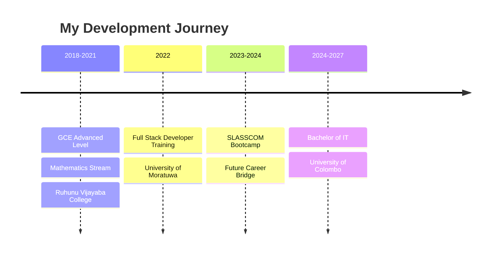

# 🚀 Januda Kodithuwakku

<div align="center">


[](https://kjanuda.github.io/JanudaJK.me/)
[](https://www.linkedin.com/in/januda-kodithuwakku/)
[](mailto:janudakodi@gmail.com)
[](tel:+94773007426)


[](https://github.com/kjanuda)

</div>

---

## 🎯 About Me

> *"A highly motivated and passionate programmer, committed to learning modern technologies"*

🎓 **Currently Pursuing:** Bachelor of Information Technology - University of Colombo  
🌱 **Always Learning:** Modern web technologies and cloud solutions  
💼 **Experience:** Full Stack Development with focus on scalable applications  
🎯 **Goal:** Creating innovative solutions for complex challenges  

<details>
<summary>📍 <b>My Journey</b></summary>


</details>

---

## 🛠️ Tech Arsenal

<div align="center">

### 🎨 Frontend Technologies


### ⚙️ Backend Technologies


### 🗄️ Databases


### ☁️ Cloud & DevOps


</div>

<details>
<summary>📊 <b>Skill Proficiency</b></summary>

```text
Full Stack Development  ████████████████████ 90%
Frontend Development   ████████████████████ 95%
Backend Development    ████████████████████ 85%
Database Management    ████████████████████ 80%
Cloud Technologies     ████████████████████ 75%
Problem Solving        ████████████████████ 95%
```
</details>

---

## 📊 GitHub Analytics

<div align="center">


</div>

<div align="center">


</div>

### 📈 Contribution Activity


---

## 🏆 Achievements & Certifications

<div align="center">


</div>

### 🎓 Education & Training
- 🎯 **Bachelor of Information Technology** - University of Colombo (2024-2027)
- 💻 **SLASSCOM Software Development Bootcamp** - Future Career Bridge (2023-2024)
- 🚀 **Full Stack Developer Training** - University of Moratuwa (2022)
- 📚 **GCE Advanced Level** - Mathematics Stream (2018-2021)

---

## 🔥 Featured Projects

<div align="center">

[](https://github.com/kjanuda/portfolio-website)
[](https://github.com/kjanuda/ecommerce-platform)

</div>

### 🌟 Project Highlights
- 💼 **Portfolio Website** - Modern React.js portfolio with responsive design
- 🛒 **E-commerce Platform** - Full-stack solution with payment integration
- 📱 **Mobile-First Applications** - Cross-platform mobile applications
- 🌐 **RESTful APIs** - Scalable backend services with Spring Boot

---

## 📈 Coding Activity

<div align="center">

<!--START_SECTION:waka-->
```text
JavaScript   8 hrs 30 mins   ████████████████░░░░░   65.2%
Java         2 hrs 45 mins   █████░░░░░░░░░░░░░░░░░   21.1%
HTML/CSS     1 hr 15 mins    ██░░░░░░░░░░░░░░░░░░░░    9.6%
PHP          30 mins         █░░░░░░░░░░░░░░░░░░░░░    3.9%
Other        3 mins          ░░░░░░░░░░░░░░░░░░░░░░    0.2%
```
<!--END_SECTION:waka-->

</div>

---

## 🤝 Let's Connect!

<div align="center">

### 🌍 Find Me Around The Web

[](https://www.linkedin.com/in/januda-kodithuwakku/)
[](https://kjanuda.github.io/JanudaJK.me/)
[](mailto:janudakodi@gmail.com)
[](https://wa.me/94773007426)

### 💬 Let's Collaborate!

🚀 **Open for:**
- Full-time Software Engineering opportunities
- Freelance web development projects
- Open source contributions
- Tech mentorship and knowledge sharing

</div>

---

<div align="center">

### 🎯 Current Focus

```javascript
const januda = {
    currentlyLearning: ["AWS Cloud Services", "Microservices", "DevOps"],
    lookingFor: "Software Engineer opportunities",
    techCommunities: ["SLASSCOM", "University Tech Clubs"],
    funFact: "I debug with console.log() and I'm not ashamed! 😄"
};
```

### ⚡ Fun Facts
- 🎮 Passionate gamer in free time
- 📚 Tech blog reader and learner
- 🌱 Contributing to open source projects
- ☕ Powered by coffee and curiosity

---


**⭐ From [Januda Kodithuwakku](https://github.com/kjanuda) with ❤️**

*"Code is like humor. When you have to explain it, it's bad." - Cory House*

</div>
