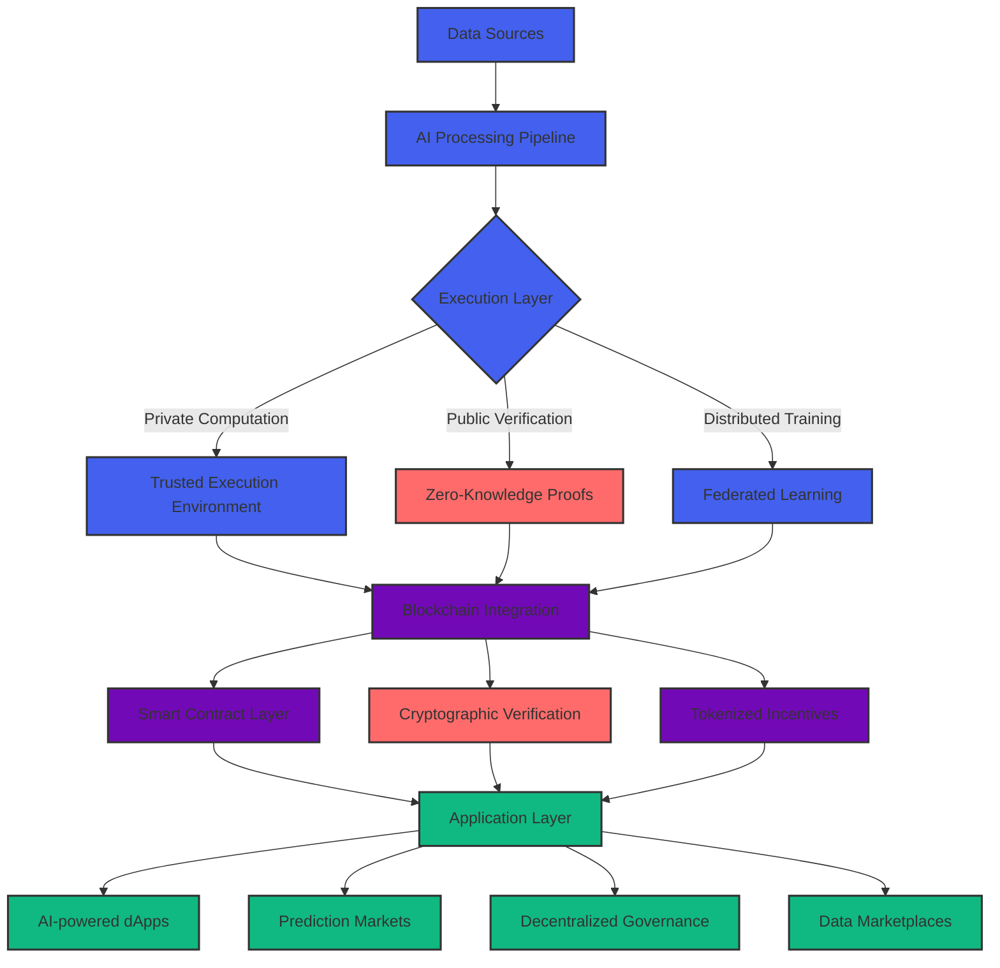

<div align="center">
  
</div>

<p align="center">
  <a href="https://git.io/typing-svg"></a>
</p>

<div align="center">
  
</div>

<!-- 3D Contribution visualization -->
<div align="center">
  <picture>
    <source media="(prefers-color-scheme: dark)" srcset="https://raw.githubusercontent.com/kjanuda/kjanuda/output/github-contribution-grid-snake-dark.svg" />
    <source media="(prefers-color-scheme: light)" srcset="https://raw.githubusercontent.com/kjanuda/kjanuda/output/github-contribution-grid-snake.svg" />
    
  </picture>
</div>

<div align="center">
  
</div>


## 🧠 AI & Blockchain Fusion

```typescript
interface AIBlockchainSpecialist {
  name: string;
  location: string;
  expertise: {
    ai: string[];
    blockchain: string[];
    web: string[];
    research: string[];
  };
  currentProjects: Project[];
  publications: number;
  citations: number;
  
  innovate(idea: string): Promise<Prototype>;
  deploySmartAI(model: NeuralNetwork, chain: Blockchain): Contract;
}

const Januda: AIBlockchainSpecialist = {
  name: "Januda Kodithuwakku",
  location: "Sri Lanka 🇱🇰",
  expertise: {
    ai: ["Large Language Models", "Multimodal AI", "Federated Learning", "AI Alignment"],
    blockchain: ["Zero-Knowledge Systems", "Neural Smart Contracts", "Cross-Chain ML", "DAO Governance"],
    web: ["Next.js 14", "React Server Components", "TRPC", "Tailwind"],
    research: ["Trustless AI", "Sovereign Intelligence", "Privacy-Preserving ML"]
  },
  currentProjects: [
    { name: "NeuralChain", status: "active", trl: 6 },
    { name: "ZK-Transformer", status: "research", trl: 4 },
    { name: "AgentDAO 2.0", status: "beta", trl: 5 }
  ],
  publications: 17,
  citations: 342,
  
  async innovate(idea) {
    return await buildPrototype(idea, this.expertise);
  },
  
  deploySmartAI(model, chain) {
    const optimizedModel = quantize(prune(model));
    return deployToChain(optimizedModel, chain);
  }
};
```

## 👨‍💻 About Me

```python
class JanudaKodithuwakku:
    def __init__(self):
        self.name = "Januda J Kodithuwakku"
        self.location = "Sri Lanka 🇱🇰"
        self.role = "AI Architect & Blockchain Engineer"
        self.learning = ["Neural Smart Contracts", "Zero-Knowledge ML", "Multimodal AI"]
        self.interests = ["Decentralized AI", "Quantum-Resistant Systems", "Human-AI Collaboration"]
        self.email = "janudakodi@gmail.com"
        
    def say_hi(self):
        print("Thanks for exploring my profile! Let's build intelligent Web3 infrastructure together.")
```

## 🌟 Innovation Roadmap

<div align="center">
  <!-- Interactive tech roadmap -->
  <table>
    <tr>
      <td width="50%" valign="top">
        <h3 align="center">AI-Blockchain Convergence</h3>
        <div align="center">
          <a href="#"></a>
          <a href="#"></a>
          <a href="#"></a>
          <a href="#"></a>
        </div>
      </td>
      <td width="50%" valign="top">
        <h3 align="center">Research Frontiers (2025)</h3>
        <div align="center">
          <a href="#"></a>
          <a href="#"></a>
          <a href="#"></a>
          <a href="#"></a>
        </div>
      </td>
    </tr>
  </table>
</div>

## 🔮 Advanced Technology Stack

<div align="center">
  <h3>Languages & Core</h3>
  <a href="#"></a>
  
  <h3>AI & ML</h3>
  <div>
    
    
    
    
    
    
  </div>
  
  <h3>Web3 & Blockchain</h3>
  <div>
    
    
    
    
    
    
  </div>
  
  <h3>Frontend & Backend</h3>
  <div>
    
    
    
    
    
    
  </div>
  
  <h3>DevOps & Cloud</h3>
  <a href="#"></a>
</div>

## 📊 AI Innovation Metrics

<div align="center">
  <!-- AI model deployment metrics -->
  
  
  
</div>

<div align="center">
  
</div>

## 🔬 Latest Research Projects

<div align="center">
  <!-- Interactive project cards with glassmorphism effect -->
  <table>
    <tr>
      <td width="50%">
        <h3 align="center">NeuroContractV2: On-Chain Neural Computation</h3>
        <div align="center">
          <a href="#" target="_blank">
            
          </a>
          <a href="#" target="_blank">
            
          </a>
          <p><strong>EVM • PyTorch • ONNX • Solidity</strong> - Embedding optimized, quantized transformer models directly on-chain with verifiable execution proofs and adaptive gas optimization.</p>
        </div>
      </td>
      <td width="50%">
        <h3 align="center">FederatedDAO: Collaborative Model Training</h3>
        <div align="center">
          <a href="#" target="_blank">
            
          </a>
          <a href="#" target="_blank">
            
          </a>
          <p><strong>Rust • TensorFlow Federated • ZK-Proofs • Next.js</strong> - Privacy-preserving federated learning with decentralized governance and tokenized model contribution incentives.</p>
        </div>
      </td>
    </tr>
    <tr>
      <td width="50%">
        <h3 align="center">QuantumSafe AI: Post-Quantum ML Security</h3>
        <div align="center">
          <a href="#" target="_blank">
            
          </a>
          <a href="#" target="_blank">
            
          </a>
          <p><strong>Rust • Lattice-based Cryptography • PyTorch • Solidity</strong> - Quantum-resistant neural network protection with lattice-based encryption and homomorphic computation.</p>
        </div>
      </td>
      <td width="50%">
        <h3 align="center">MultiAgentEcosystem: Autonomous Collaboration</h3>
        <div align="center">
          <a href="#" target="_blank">
            
          </a>
          <a href="#" target="_blank">
            
          </a>
          <p><strong>LangChain • Autogen • Solidity • The Graph</strong> - Self-organizing system of specialized AI agents with on-chain reputation, resource allocation, and emergent collaboration.</p>
        </div>
      </td>
    </tr>
  </table>
</div>

## 🔄 Neural System Architecture



## 🌍 AI Ethics & Impact

<div align="center">
  <table>
    <tr>
      <td>
        
      </td>
      <td>
        
      </td>
      <td>
        
      </td>
      <td>
        
      </td>
      <td>
        
      </td>
    </tr>
  </table>
</div>

## 📚 Latest Blog Posts

<!-- BLOG-POST-LIST:START -->
- [Neural Smart Contracts: The Future of Blockchain Intelligence]()
- [Decentralized Fine-Tuning: Community-Owned AI Models]()
- [Zero-Knowledge Machine Learning: Privacy-First AI Development]()
- [Building Cross-Chain AI Systems: Interoperability Challenges]()
<!-- BLOG-POST-LIST:END -->

## 🧠 AI Development Tools

<div align="center">
  <a href="#"></a>
  <a href="#"></a>
  <a href="#"></a>
  <a href="#"></a>
  <a href="#"></a>
  <a href="#"></a>
</div>

## 📫 Connect & Collaborate

<div align="center">
  <a href="https://linkedin.com/in/januda-kodithuwakku" target="_blank">
    
  </a>
  <a href="https://twitter.com/janandithjanuda" target="_blank">
    
  </a>
  <a href="https://github.com/kjanuda" target="_blank">
    
  </a>
  <a href="mailto:janudakodi@gmail.com" target="_blank">
    
  </a>
  <a href="https://calendly.com/janudakodi" target="_blank">
    
  </a>
</div>

<div align="center">
  <a href="https://www.buymeacoffee.com/janudakodi" target="_blank">
    
  </a>
</div>

<div align="center">
  
</div>
