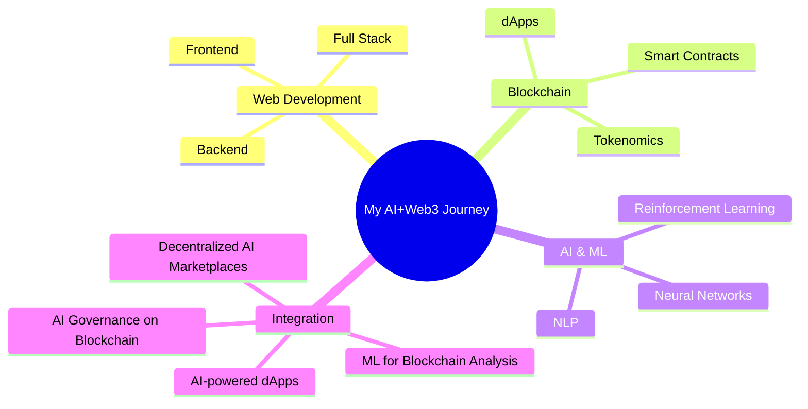

<div align="center">
  
</div>

<p align="center">
  <a href="https://git.io/typing-svg"></a>
</p>

<div align="center">
  
</div>


## 👨‍💻 About Me

```python
class JanudaKodithuwakku:
    def __init__(self):
        self.name = "Januda J Kodithuwakku"
        self.location = "Sri Lanka 🇱🇰"
        self.role = "Fullstack Developer"
        self.learning = ["React", "Next.js", "Web3", "AI Integration"]
        self.interests = ["Blockchain", "AI", "Web Development"]
        self.email = "janudakodi@gmail.com"
        
    def say_hi(self):
        print("Thanks for visiting my GitHub profile! Let's build something amazing together.")
```

- 🔭 Working on **AI-integrated blockchain applications**
- 🌱 Exploring **Web3 + AI integration possibilities**
- 🤝 Open to collaborate on **innovative tech projects**
- 💬 Ask me about **Web Development, Blockchain, AI integration**
- 🎯 2025 Goals: **Contribute to more open source projects**
- ⚡ Fun fact: **I'm building a decentralized AI marketplace**

## 🤖 AI Projects & Interests

<table>
  <tr>
    <td width="50%" valign="top">
      <h3 align="center">AI Skills</h3>
      <div align="center">
        <a href="#"></a>
        <a href="#"></a>
        <a href="#"></a>
        <a href="#"></a>
        <a href="#"></a>
      </div>
    </td>
    <td width="50%" valign="top">
      <h3 align="center">Current AI Projects</h3>
      <div align="center">
        <a href="#"></a>
        <a href="#"></a>
        <a href="#"></a>
        <a href="#"></a>
      </div>
    </td>
  </tr>
</table>

## 💻 Tech Stack

<div align="center">
<h3>Languages</h3>
  


<h3>Frontend</h3>


<h3>Backend & Database</h3>


<h3>AI & ML</h3>


<h3>Blockchain</h3>


<h3>DevOps & Tools</h3>


</div>

## 📊 Advanced Analytics

<div align="center">
  
  
</div>

<div align="center">
  
</div>

## 📚 Latest Blog Posts
<!-- BLOG-POST-LIST:START -->
- [How AI is Transforming Blockchain Technology](https://medium.com/@janudakodi)
- [Building Decentralized Applications with Next.js and Ethereum](https://medium.com/@janudakodi)
- [The Future of Web3: AI Integration Possibilities](https://medium.com/@janudakodi)
<!-- BLOG-POST-LIST:END -->

## 🧠 AI-Powered Development Journey

<div align="center">



</div>

## 🌟 Featured Projects

<table>
  <tr>
    <td width="50%">
      <h3 align="center">AI-Powered Blockchain Analytics</h3>
      <div align="center">
        <a href="#" target="_blank"></a>
        <p>
          <a href="#" target="_blank">
            
          </a>
          <a href="#" target="_blank">
            
          </a>
        </p>
        <p><strong>React, TensorFlow.js, Web3.js, Ethereum</strong> - Platform that uses AI to analyze blockchain data and predict market trends with interactive visualizations.</p>
      </div>
    </td>
    <td width="50%">
      <h3 align="center">Decentralized AI Marketplace</h3>
      <div align="center">
        <a href="#" target="_blank"></a>
        <p>
          <a href="#" target="_blank">
            
          </a>
          <a href="#" target="_blank">
            
          </a>
        </p>
        <p><strong>Next.js, Solidity, IPFS, HuggingFace</strong> - A decentralized marketplace where users can buy, sell and trade AI models using smart contracts and tokens.</p>
      </div>
    </td>
  </tr>
</table>

## 📈 Contributions & Activity

<div align="center">
  
</div>

<div align="center">
  
  
  
</div>

## 🛠️ AI Developer Tools I Use

<div align="center">
  <a href="#"></a>
  <a href="#"></a>
  <a href="#"></a>
  <a href="#"></a>
  <a href="#"></a>
  <a href="#"></a>
</div>

## 🌐 Connect with me

<div align="center">
  <a href="https://linkedin.com/in/januda-kodithuwakku" target="_blank">
    
  </a>
  <a href="https://twitter.com/janandithjanuda" target="_blank">
    
  </a>
  <a href="https://instagram.com/januda_j_kodithuwakku" target="_blank">
    
  </a>
  <a href="https://medium.com/@janudakodi" target="_blank">
    
  </a>
  <a href="https://dev.to/januda_kodithuwakku" target="_blank">
    
  </a>
  <a href="https://www.youtube.com/c/janudajanandithkodithuwakku" target="_blank">
    
  </a>
</div>

## 🎮 Personal Interests

<div align="center">
  
  
  
  
</div>

## 💬 Quote of the Day

<div align="center">
  
  
  
</div>

<div align="center">
  
</div>

<div align="center">
  <a href="https://www.buymeacoffee.com/janudakodi" target="_blank">
    
  </a>
</div>

<div align="center">
  
</div>
