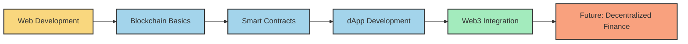

# <div align="center"></div>

<div align="center">
  <h1>👋 Hello World, I'm Januda J Kodithuwakku</h1>
  <h3>Fullstack Developer | Blockchain Enthusiast | Web3 Explorer</h3>
  
  [](https://github.com/kjanuda)
  [](https://github.com/kjanuda?tab=followers)
  [](https://twitter.com/janandithjanuda)
</div>


## 🚀 About Me

```javascript
const januda = {
  location: "Sri Lanka",
  role: "Fullstack Developer",
  code: ["JavaScript", "TypeScript", "HTML", "CSS", "Java", "C++"],
  currentlyLearning: ["React", "Next.js", "Web3", "MySQL"],
  passionateAbout: "Blockchain Technologies",
  email: "janudakodi@gmail.com",
  funFact: "I'm building the decentralized future, one block at a time"
};
```

- 🔭 I'm currently working on **building dApps that solve real-world problems**
- 🌱 I'm exploring **React, Next.js, Web3, and MySQL**
- 👯 I'm looking to collaborate on **open-source blockchain projects**
- 💬 Ask me about **HTML, CSS, JavaScript, Java, C++, React**
- 📫 How to reach me: **janudakodi@gmail.com**

## 💻 Tech Stack

<div align="center">

### Frontend


### Backend


### Mobile


### Database & Cloud


</div>

## 📊 GitHub Analytics

<div align="center">
  
  
</div>

<div align="center">
  
</div>

<div align="center">
  
  
  
</div>

## 🌐 Blockchain Journey

<div align="center">



</div>

## 🔗 Connect with me

<div align="center">
  <a href="https://linkedin.com/in/januda-kodithuwakku" target="_blank">
    
  </a>
  <a href="https://twitter.com/janandithjanuda" target="_blank">
    
  </a>
  <a href="https://instagram.com/januda_j_kodithuwakku" target="_blank">
    
  </a>
  <a href="mailto:janudakodi@gmail.com">
    
  </a>
  <a href="https://medium.com/@janudakodi" target="_blank">
    
  </a>
  <a href="https://www.youtube.com/c/janudajanandithkodithuwakku" target="_blank">
    
  </a>
</div>

<div align="center">
  
  ### 🎯 Fun Fact
  
  "I'm building the decentralized future, one block at a time!"
  
  
  
</div>

---

<div align="center">
  
</div>

<div align="center">
  <a href="https://www.buymeacoffee.com/janudakodi" target="_blank">
    
  </a>
</div>
