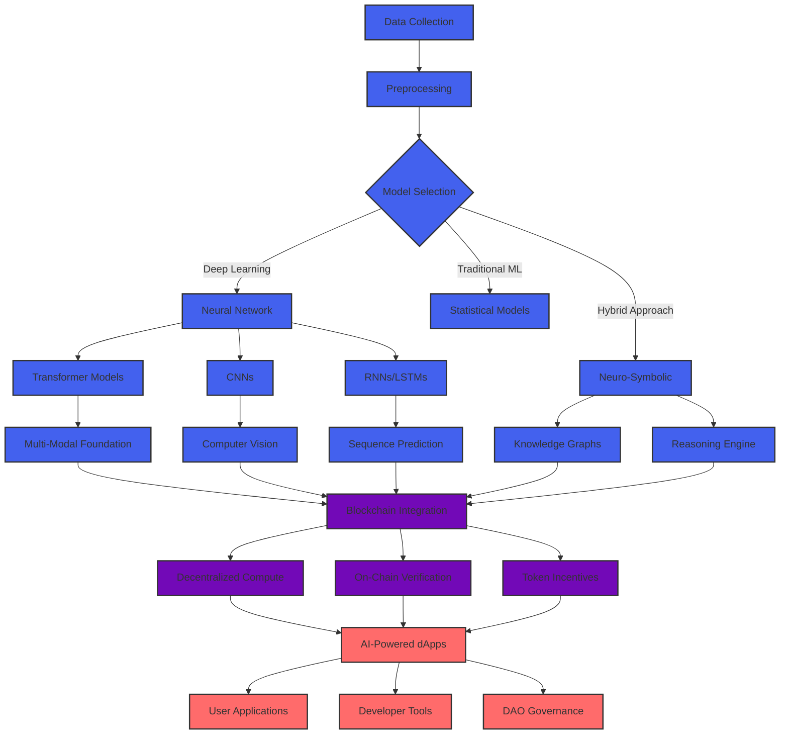

<div align="center">
  
</div>

<p align="center">
  <a href="https://git.io/typing-svg"></a>
</p>

<div align="center">
  
</div>


## 👨‍💻 About Me

```javascript
const JanudaKodithuwakku = {
  location: "Sri Lanka 🇱🇰",
  title: "AI-Blockchain Integration Specialist",
  focus: "Decentralized Intelligence Systems",
  skills: {
    ai: ["Deep Learning", "NLP", "Computer Vision", "Generative AI"],
    blockchain: ["Smart Contracts", "DeFi", "NFTs", "DAO Governance"],
    web: ["React", "Next.js", "Node.js", "TailwindCSS"],
    architecture: ["Microservices", "Serverless", "Edge Computing"]
  },
  currentProject: "Building a decentralized AI model marketplace with on-chain governance",
  contact: "janudakodi@gmail.com",
  
  philosophy: () => {
    return "Technology should augment human potential, not replace it";
  }
};
```

- 🧠 Building **Trustless AI Networks** with verifiable compute and decentralized intelligence
- 🔮 Pioneering **Neural Contract Programming** - embedding ML models directly in smart contracts
- 🌐 Creating **Sovereign AI Agents** that leverage blockchain for identity and decision transparency
- 📊 Developing **Zero-Knowledge ML** pipelines for privacy-preserving predictive analytics
- 🛡️ Researching **Cryptographic ML Safety** protocols for responsible AI deployment
- 🤝 Open to collaborate on projects at the intersection of **AI, Blockchain and Human Flourishing**

## 🧬 AI Research Focus

<table>
  <tr>
    <td width="50%" valign="top">
      <h3 align="center">Advanced AI Capabilities</h3>
      <div align="center">
        <a href="#"></a>
        <a href="#"></a>
        <a href="#"></a>
        <a href="#"></a>
        <a href="#"></a>
      </div>
    </td>
    <td width="50%" valign="top">
      <h3 align="center">Blockchain-AI Integration Research</h3>
      <div align="center">
        <a href="#"></a>
        <a href="#"></a>
        <a href="#"></a>
        <a href="#"></a>
        <a href="#"></a>
      </div>
    </td>
  </tr>
</table>

## 🔧 Advanced Technology Stack

<div align="center">
<details>
<summary><b>🧠 AI & Machine Learning Ecosystem 🧠</b></summary>
<br>


</details>

<details>
<summary><b>⛓️ Blockchain & Web3 Technologies ⛓️</b></summary>
<br>


</details>

<details>
<summary><b>🌐 Web & Application Development 🌐</b></summary>
<br>


</details>

<details>
<summary><b>☁️ Cloud & DevOps Infrastructure ☁️</b></summary>
<br>


</details>
</div>

## 🔬 AI Research Dashboard

<div align="center">
  
</div>

<div align="center">
  
</div>

## 📊 Neural Network Architecture Vision



## 🌟 Featured Research Projects

<table>
  <tr>
    <td width="50%">
      <h3 align="center">NeuralChain: Decentralized Model Marketplace</h3>
      <div align="center">
        <a href="#" target="_blank"></a>
        <p>
          <a href="#" target="_blank">
            
          </a>
          <a href="#" target="_blank">
            
          </a>
        </p>
        <p><strong>Next.js, Solidity, PyTorch, IPFS</strong> - Decentralized marketplace for AI models with on-chain verification, reputation systems, and computational resource sharing.</p>
      </div>
    </td>
    <td width="50%">
      <h3 align="center">ZKLearning: Privacy-Preserving ML</h3>
      <div align="center">
        <a href="#" target="_blank"></a>
        <p>
          <a href="#" target="_blank">
            
          </a>
          <a href="#" target="_blank">
            
          </a>
        </p>
        <p><strong>Rust, ZK-SNARKs, PyTorch, Ethereum</strong> - Zero-knowledge proofs for model training verification without revealing training data or model parameters.</p>
      </div>
    </td>
  </tr>
  <tr>
    <td width="50%">
      <h3 align="center">AgentDAO: Autonomous Agent Economy</h3>
      <div align="center">
        <a href="#" target="_blank"></a>
        <p>
          <a href="#" target="_blank">
            
          </a>
          <a href="#" target="_blank">
            
          </a>
        </p>
        <p><strong>TypeScript, LangChain, Solidity, The Graph</strong> - Self-governing ecosystem of AI agents that collaborate, compete and trade services using blockchain-based incentive mechanisms.</p>
      </div>
    </td>
    <td width="50%">
      <h3 align="center">NeuroContracts: Neural Smart Contracts</h3>
      <div align="center">
        <a href="#" target="_blank"></a>
        <p>
          <a href="#" target="_blank">
            
          </a>
          <a href="#" target="_blank">
            
          </a>
        </p>
        <p><strong>Solidity, ONNX, TensorFlow.js, EVM</strong> - Embedding compressed neural networks directly in smart contracts for on-chain inference with verifiable execution.</p>
      </div>
    </td>
  </tr>
</table>

## 🧪 Experimental AI-Blockchain Integration

<div align="center">
  
</div>

<div align="center">
  <table>
    <tr>
      <td></td>
      <td></td>
      <td></td>
    </tr>
  </table>
</div>

## 📈 Neural Network Contribution Graph

<div align="center">
  
</div>

## 🛡️ Advanced Development Environment

<div align="center">
  <a href="#"></a>
  <a href="#"></a>
  <a href="#"></a>
  <a href="#"></a>
  <a href="#"></a>
  <a href="#"></a>
  <a href="#"></a>
  <a href="#"></a>
  <a href="#"></a>
  <a href="#"></a>
</div>

## 🧬 Research Collaborations & Publications

<div align="center">
  <a href="#"></a>
  <a href="#"></a>
  <a href="#"></a>
  <a href="#"></a>
  <a href="#"></a>
  <a href="#"></a>
</div>

## 🌐 Professional Network

<div align="center">
  <a href="https://linkedin.com/in/januda-kodithuwakku" target="_blank">
    
  </a>
  <a href="https://twitter.com/janandithjanuda" target="_blank">
    
  </a>
  <a href="https://github.com/kjanuda" target="_blank">
    
  </a>
  <a href="https://medium.com/@janudakodi" target="_blank">
    
  </a>
  <a href="https://dev.to/januda_kodithuwakku" target="_blank">
    
  </a>
  <a href="https://discord.gg/janudakodi" target="_blank">
    
  </a>
  <a href="https://www.youtube.com/c/janudajanandithkodithuwakku" target="_blank">
    
  </a>
</div>

## 💭 Research Philosophy

<div align="center">
  <blockquote
