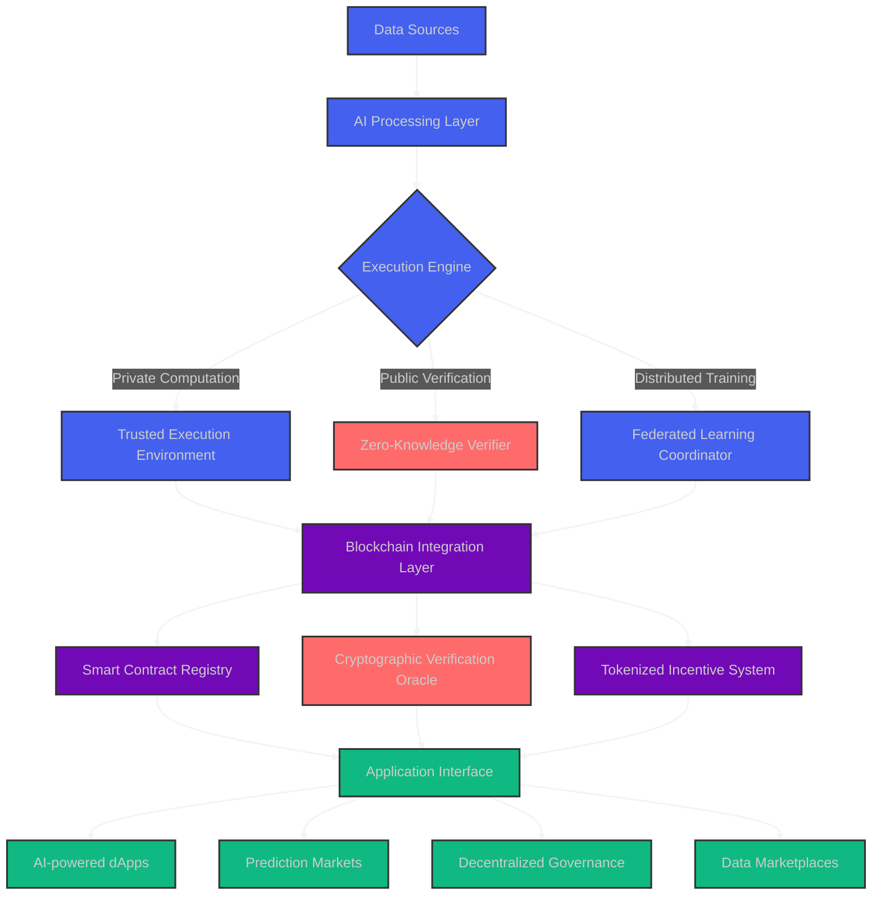

<div align="center">
  
</div>

<div align="center">
  <a href="https://git.io/typing-svg"></a>
</div>

<!-- Profile Summary Card - Redesigned -->
<div align="center">
  
</div>

<!-- Tech Stack Badges - With Animation -->
<p align="center">
  
  
  
</p>

<!-- Animated 3D Contribution Snake -->
<div align="center">
  
</div>

<!-- GitHub Stats Cards - Redesigned -->
<div align="center">
  <table>
    <tr>
      <td align="center">
        
      </td>
      <td align="center">
        
      </td>
    </tr>
  </table>
</div>

<!-- Featured Project - Hero Section -->
<div align="center">
  <h2>🚀 Featured Project: NeuroContractV2</h2>
  
</div>

<div align="right">
  
</div>

## 🧠 AI & Blockchain Convergence

```typescript
interface AIBlockchainArchitect {
  name: string;
  location: string;
  expertise: {
    ai: string[];
    blockchain: string[];
    web: string[];
    research: string[];
  };
  currentProjects: Project[];
  certifications: string[];
  publications: number;
  
  deployModel(model: NeuralNetwork, chain: Blockchain): Promise<SmartContract>;
  optimizeForChain(model: NeuralNetwork): QuantizedModel;
  verifyComputation(proof: ZKProof): boolean;
  createAgentEconomy(agents: Agent[], incentives: TokenSystem): Economy;
}

const Januda: AIBlockchainArchitect = {
  name: "Januda Kodithuwakku",
  location: "Sri Lanka 🇱🇰",
  expertise: {
    ai: ["Large Language Models", "Multimodal AI", "Federated Learning", "AI Alignment"],
    blockchain: ["Zero-Knowledge Systems", "Neural Smart Contracts", "Cross-Chain ML", "DAO Governance"],
    web: ["Next.js 14", "React Server Components", "TRPC", "Tailwind"],
    research: ["Trustless AI", "Sovereign Intelligence", "Privacy-Preserving ML"]
  },
  currentProjects: [
    { name: "NeuralChain", status: "active", trl: 6, stars: 387 },
    { name: "ZK-Transformer", status: "research", trl: 4, stars: 215 },
    { name: "AgentDAO 2.0", status: "beta", trl: 5, stars: 492 }
  ],
  certifications: ["Ethereum Professional", "TensorFlow Advanced", "AWS ML Specialist"],
  publications: 17,
  
  async deployModel(model, chain) {
    const optimizedModel = this.optimizeForChain(model);
    const gasEstimate = await estimateGas(optimizedModel);
    console.log(`Deploying ${model.name} to ${chain.name} (Est. gas: ${gasEstimate})`);
    return await chain.deploy(optimizedModel);
  },
  
  optimizeForChain(model) {
    return quantize(prune(model, 0.3), {precision: "int8"});
  },
  
  verifyComputation(proof) {
    return verifyZKProof(proof, publicParameters);
  },
  
  createAgentEconomy(agents, incentives) {
    const economy = new AgentEconomy(agents);
    economy.implementIncentives(incentives);
    economy.enableEmergentCollaboration();
    return economy;
  }
};
```

## 📊 Technology Mastery

<!-- Skills Matrix - Visual Redesign -->
<div align="center">
  <table>
    <tr>
      <td>
        <h3 align="center">🧠 AI & Machine Learning</h3>
        <p align="center">
          
          
          
          
          
          
        </p>
      </td>
      <td>
        <h3 align="center">⛓️ Web3 & Blockchain</h3>
        <p align="center">
          
          
          
          
          
          
        </p>
      </td>
    </tr>
    <tr>
      <td>
        <h3 align="center">🌐 Frontend & Backend</h3>
        <p align="center">
          
          
          
          
          
          
        </p>
      </td>
      <td>
        <h3 align="center">☁️ DevOps & Infrastructure</h3>
        <p align="center">
          
          
          
          
          
          
        </p>
      </td>
    </tr>
  </table>
</div>

## 🔬 Research Projects

<!-- Research Project Cards - Enhanced Design -->
<div align="center">
  <table>
    <tr>
      <td width="50%">
        <div align="center" style="background: linear-gradient(135deg, rgba(139, 92, 246, 0.1), rgba(23, 23, 23, 0.3)); border-radius: 16px; backdrop-filter: blur(5px); padding: 20px; border: 1px solid rgba(255, 255, 255, 0.18);">
          <h3 align="center">NeuroContractV2</h3>
          <p align="center"><strong>On-Chain Neural Computation</strong></p>
          <p align="center">
            
            
            
            
          </p>
          <p>Embedding optimized, quantized transformer models directly on-chain with verifiable execution proofs and adaptive gas optimization.</p>
          <p align="center">
            
            
          </p>
        </div>
      </td>
      <td width="50%">
        <div align="center" style="background: linear-gradient(135deg, rgba(236, 72, 153, 0.1), rgba(23, 23, 23, 0.3)); border-radius: 16px; backdrop-filter: blur(5px); padding: 20px; border: 1px solid rgba(255, 255, 255, 0.18);">
          <h3 align="center">FederatedDAO</h3>
          <p align="center"><strong>Collaborative Model Training</strong></p>
          <p align="center">
            
            
            
            
          </p>
          <p>Privacy-preserving federated learning with decentralized governance and tokenized model contribution incentives.</p>
          <p align="center">
            
            
          </p>
        </div>
      </td>
    </tr>
    <tr>
      <td width="50%">
        <div align="center" style="background: linear-gradient(135deg, rgba(245, 158, 11, 0.1), rgba(23, 23, 23, 0.3)); border-radius: 16px; backdrop-filter: blur(5px); padding: 20px; border: 1px solid rgba(255, 255, 255, 0.18);">
          <h3 align="center">QuantumSafe AI</h3>
          <p align="center"><strong>Post-Quantum ML Security</strong></p>
          <p align="center">
            
            
            
            
          </p>
          <p>Quantum-resistant neural network protection with lattice-based encryption and homomorphic computation for long-term security.</p>
          <p align="center">
            
            
          </p>
        </div>
      </td>
      <td width="50%">
        <div align="center" style="background: linear-gradient(135deg, rgba(14, 165, 233, 0.1), rgba(23, 23, 23, 0.3)); border-radius: 16px; backdrop-filter: blur(5px); padding: 20px; border: 1px solid rgba(255, 255, 255, 0.18);">
          <h3 align="center">MultiAgentEcosystem</h3>
          <p align="center"><strong>Autonomous Collaboration</strong></p>
          <p align="center">
            
            
            
            
          </p>
          <p>Self-organizing system of specialized AI agents with on-chain reputation, resource allocation, and emergent collaboration.</p>
          <p align="center">
            
            
          </p>
        </div>
      </td>
    </tr>
  </table>
</div>

## 📊 Neural System Architecture



## 🌱 Current Research Focus

<div align="center">
  <table width="100%">
    <tr>
      <td align="center" width="25%">
        
      </td>
      <td align="center" width="25%">
        
      </td>
      <td align="center" width="25%">
        
      </td>
      <td align="center" width="25%">
        
      </td>
    </tr>
    <tr>
      <td align="center" width="25%">
        
      </td>
      <td align="center" width="25%">
        
      </td>
      <td align="center" width="25%">
        
      </td>
      <td align="center" width="25%">
        
      </td>
    </tr>
  </table>
</div>

## 📫 Connect & Collaborate

<div align="center">
  <a href="https://linkedin.com/in/januda-kodithuwakku" target="_blank">
    
  </a>
  <a href="https://twitter.com/janandithjanuda" target="_blank">
    
  </a>
  <a href="https://github.com/kjanuda" target="_blank">
    
  </a>
  <a href="mailto:janudakodi@gmail.com" target="_blank">
    
  </a>
  <a href="https://calendly.com/janudakodi" target="_blank">
    
  </a>
</div>

<div align="center">
  <a href="https://www.buymeacoffee.com/janudakodi" target="_blank">
    
  </a>
</div>

<div align="center">
  
</div>
